# EcommerceBotGuide

  

## *Premiumbypg Ecommerce Bot အသုံးပြုပုံ*

## 📢 Official Links

  
  &nbsp;&nbsp;
  
    &nbsp;&nbsp;
  
    &nbsp;&nbsp;
  

### Step 1 : *“/start ” နိပ့်ပီး bot ကို စတင်ပါ။*

  

### Step 2 : *“Vpn , Graphic Design , Video Editing , Virtual Meeting (Zoom)”  - မိမိဝယ်ယူချင်သော Product Categories ကို နိပ့်ပါ။*

  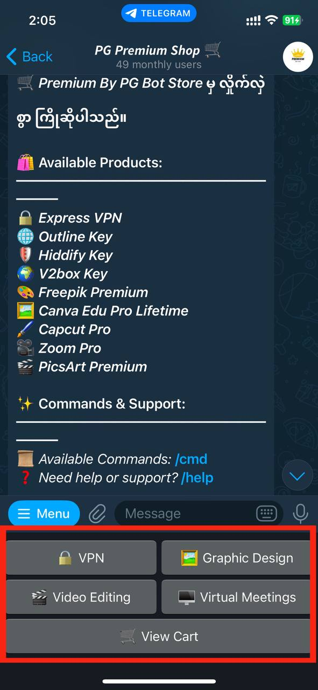

### Step 3 : *“Vpn - Express Vpn , Outline , Hiddify , V2box” မိမိ ဝယ်ယူလိုသော Product ကို နိပ့်ပါ။*

  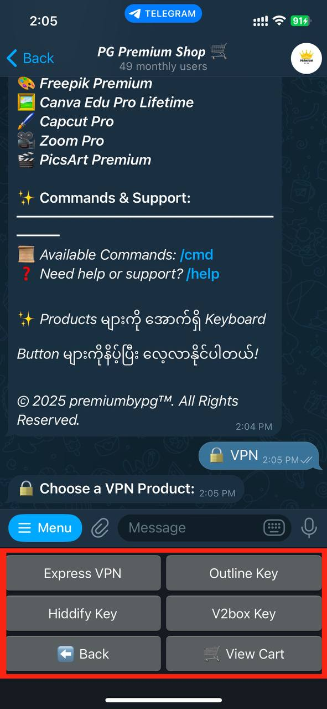

### Step 4 : *နှစ်သက်ရာ Product ကို နိပ့်ပီး “Add to cart” ဖြင့် Cart ထဲထည့်ပါ။*

  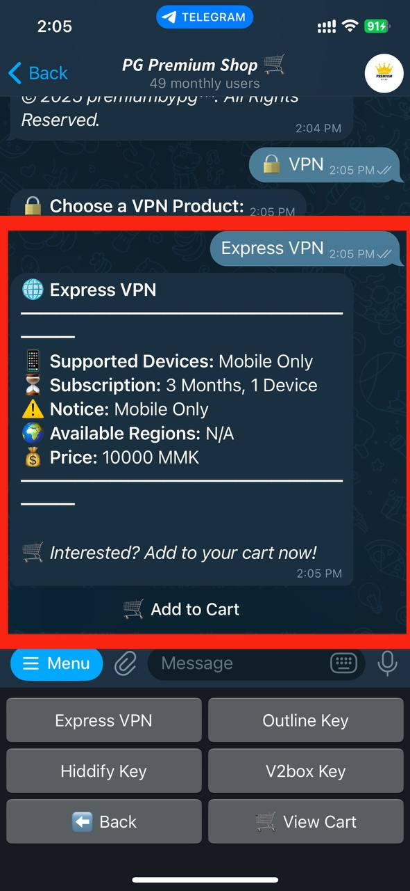

### Step 5 : *“Add to cart” နိပ့်ပီး ရင် “Bot”မှ ယခုလို စာပြန်ပါလိမ့်မယ်။*

  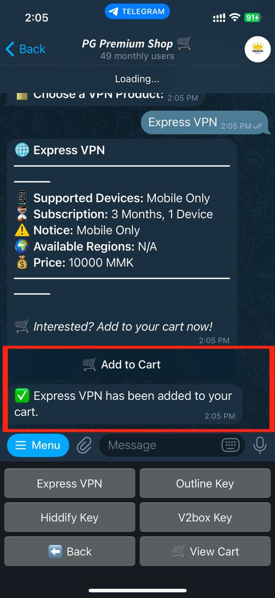

### Step 6 : *“Graphic Design - FreePik ,  Canva Edu Pro ” မိမိဝယ်ယူလိုသော Product ကို နိပ့်ပါ။*

  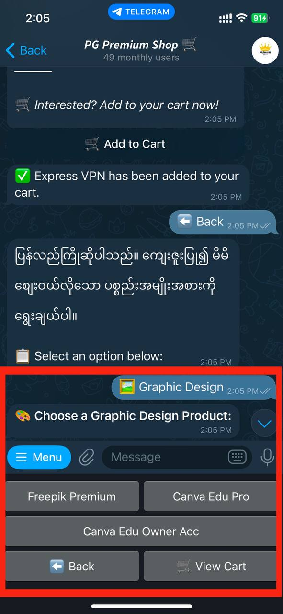

### Step 7 : *နှစ်သက်ရာ Product ကို နိပ့်ပီး “Add to cart” ဖြင့် Cart ထဲထည့်ပါ။*

  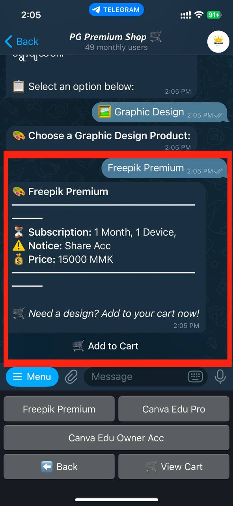

### Step 8 : *“Add to cart” နိပ့်ပီး ရင် “Bot”မှ ယခုလို စာပြန်ပါလိမ့်မယ်။*

  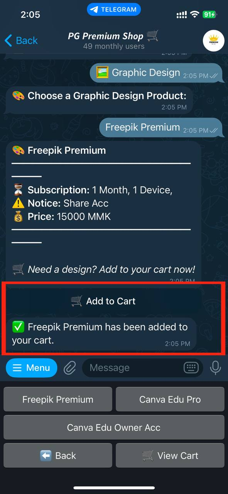

### Step 9 : *“Add to cart ”  နိပ့်ထားတဲ့ Product တွေကို “View Cart” နိပ့်ပီးကြည့်ရှု့နိုင်ပါတယ်။*

  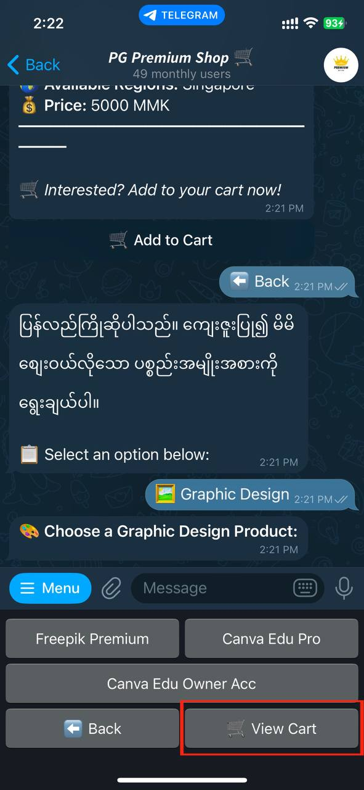

### Step 10 : *စျေးဝယ်ယူခြင်းပီးလျှင် “CheckOut” နိပ့်ပါ။ Cart ထဲက Productများကိုဖျက်လိုပါက  “Clear Cart”  ကိုနိပ့်ပါ။*

  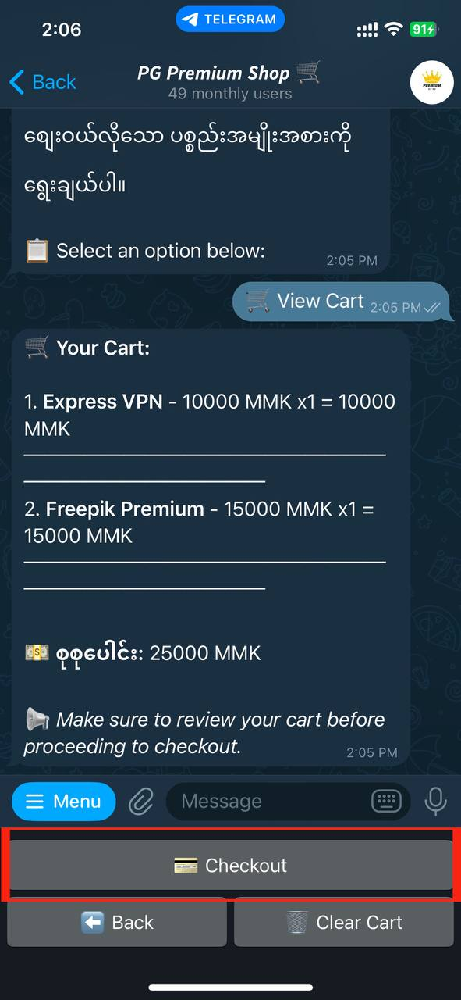

### Step 11 : *“Checkout” နိပ့်ပီးလျှင် “Order Summary” ပြပါလိမ့်မယ် မိမိပေးချေလိုသော Payment ကို နိပ့်ပီးပါက “Bot” မှ သက်ဆိုင်ရာ Qr Code ချပေးပါလိမ့်မယ်။*

  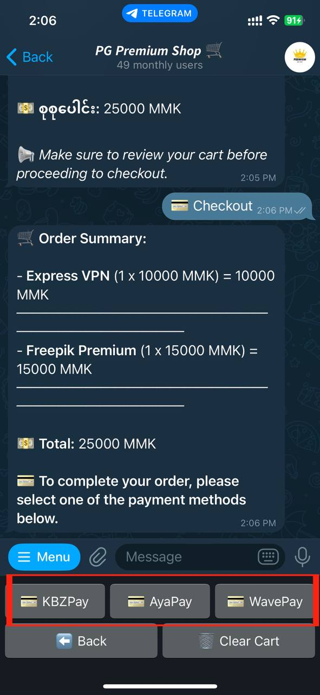

### Step 12 : *ငွေပေးချေမူပီးပါက “Payment Done” ကိုနိပ့်ပါ Bot မှ “Payment Invoice” ကို ထုတ်ပေးပါလိမ့်မယ် Payment Screenshot ကို Bot မှ တစ်ဆင့် Admin ဆီ ပို့ပေးလို့ရပါတယ်  (သို့မဟုတ်)Admin ကို ဆက်သွယ်ရန် Box တစ်ခု ကျလာပါလိမ့်မယ်။*

  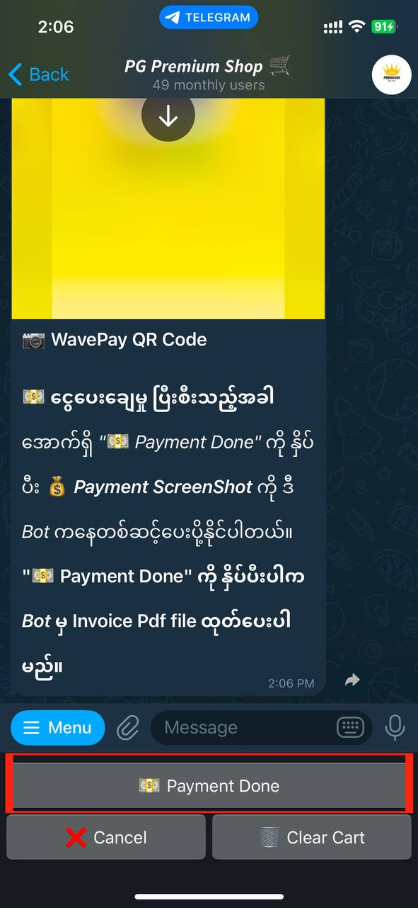

### Step 13 : *“Payment Done” နိပ့်ပီး Bot မှ Payment Invoice ထုတ်ပေးတဲ့ ပုံစံဖြစ်ပါတယ်။ 🛍️ Happy Shopping! 😊*

  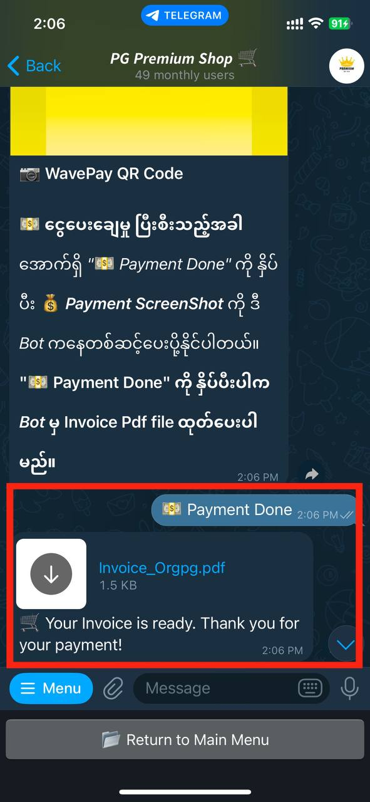

  
  &nbsp;&nbsp;
  
    &nbsp;&nbsp;
  
    &nbsp;&nbsp;
  

